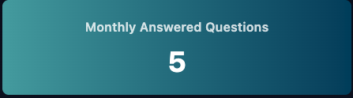
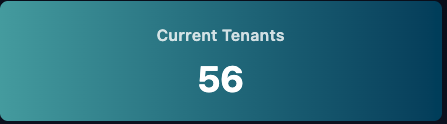
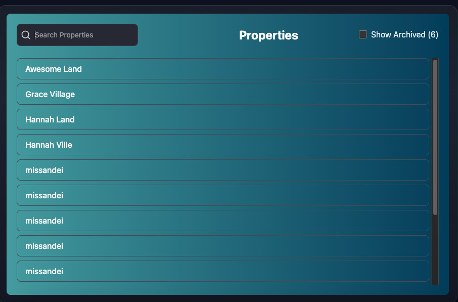
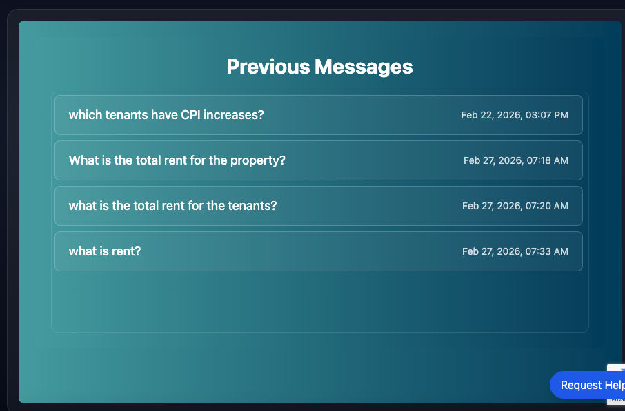

# Dashboard

After Logging into Lease Link you will be taken to the Dashboard.

The Dashboard has 6 Components that we will use to help Master Lease Link:
- Monthly Answered Questions
- Tenant Docs Extracted
- Current Tenants
- Number of Properties
- Property List
- Previous Message List

## Monthly Answered Questions

This Module Shows how many questions Lease Link answered this month.

This is great to help you know how much Lease Link is helping you out!

 

 ## Tenant Docs Extracted

 This Module Shows how many Leases, Amendments, Renewals and Other Types of Lease Documents are loaded into Lease Link.

  

  ## Current Tenants

  This Module Shows the current number of Tenants that are created in Lease Link.

## Number of Properties
This Module Shows the Number of Properties in Lease Link!

   

## Property List
This Shows a List of all the Properties in Lease Link. Clicking on a Property will take you to the [Property Page](./property.md).

You may search for the property you want in the search bar, and if you want to find an archived Property Click: "Show Archived"

## Previous Messages
Previous Messages show you the messages that you've previously asked. You may click on any message in this list to go to [Chat Page](./chatPage.md)

