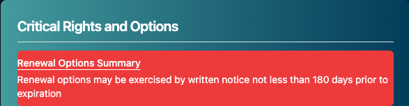
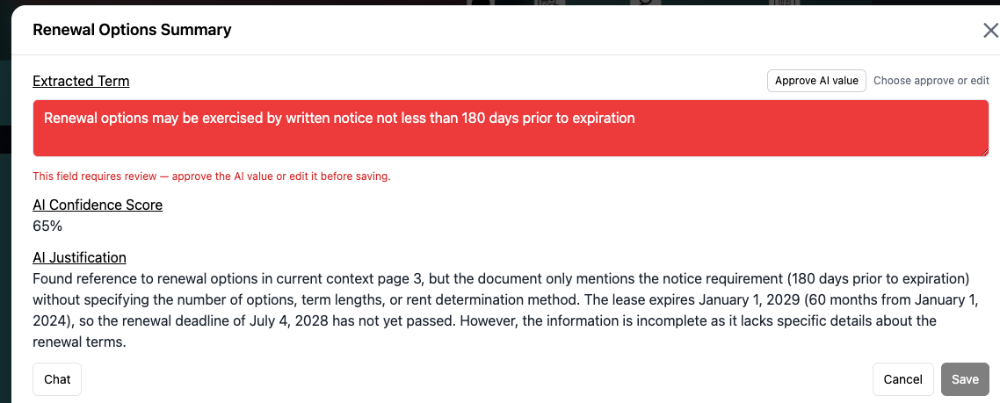
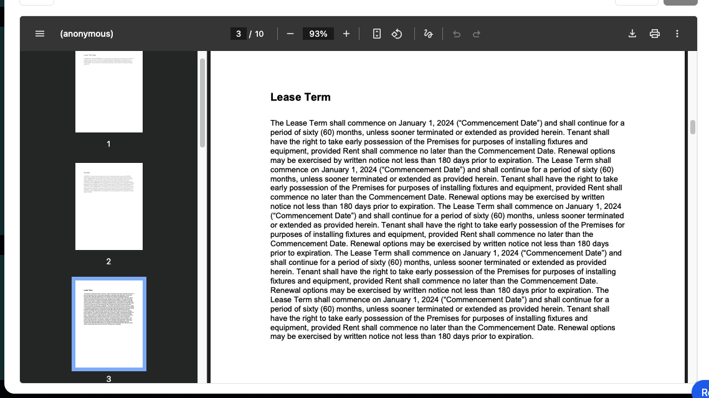

# Extraction

Extraction is taking key terms from the lease to give you a quick look without having to wait on a question.

We use the term Extraction instead of the more common term Abstraction because we are extracting it directly from the lease without making alterations!

## Where to Find Them

There are 3 places to view extracted terms from the lease in Lease Link:
- [Chat Page](./chatPage.md)
- [Tenant Page](./tenant.md)
- [Tenant Terms](./tenantTerms.md)

Tenant Terms contains all extracted Terms.

Tenant Page contains most important Terms.

Chat Page only has important dates!

## Reviewing Terms

We are using AI to extract these terms. The AI sometimes gets it wrong, so we've developed a system where if the AI confidence is too low, it will flag the term for manual review.

If a term is flagged for manual review, it will appear red!

You can click on the term to check it is accurate. If the answer is correct, click approve AI Value. If it is not correct, edit the value in the text box!

Click Save when you've finished editing.

**If you notice a term that isn't flagged doesn't provide the answer you want, you can still edit them using the same process**

When editing the term you may want to review the lease in order to change the answer, the lease is already pulled up in the pop-up window for you to review!

## Lease Commencement Date
If the lease doesn't have a commencement date, because it is defined later. You can manually add it. Manually Adding the commencement date will calculate the rent schedules in the lease by the commencement date. EX: Your lease says rent is $1,200 month 1-12, then $1,400 month 13-24.

When you enter a Lease Commecement date of 2/1/2026, it will return the rent schedule as 2/1/2026 - 1/31/2027 $1,200: 2/1/2027 - 1/31/2028: $1,400.

**This may take a few minutes to update**

## CPI Leases

If your rent increases are adjusted by CPI instead of explicitely stated, Lease Link will pull the CPI data from the Burear of Labor Statistics and calculate the current rate based on the appropriate CPI increases