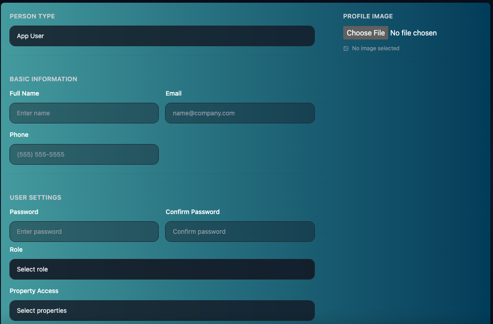
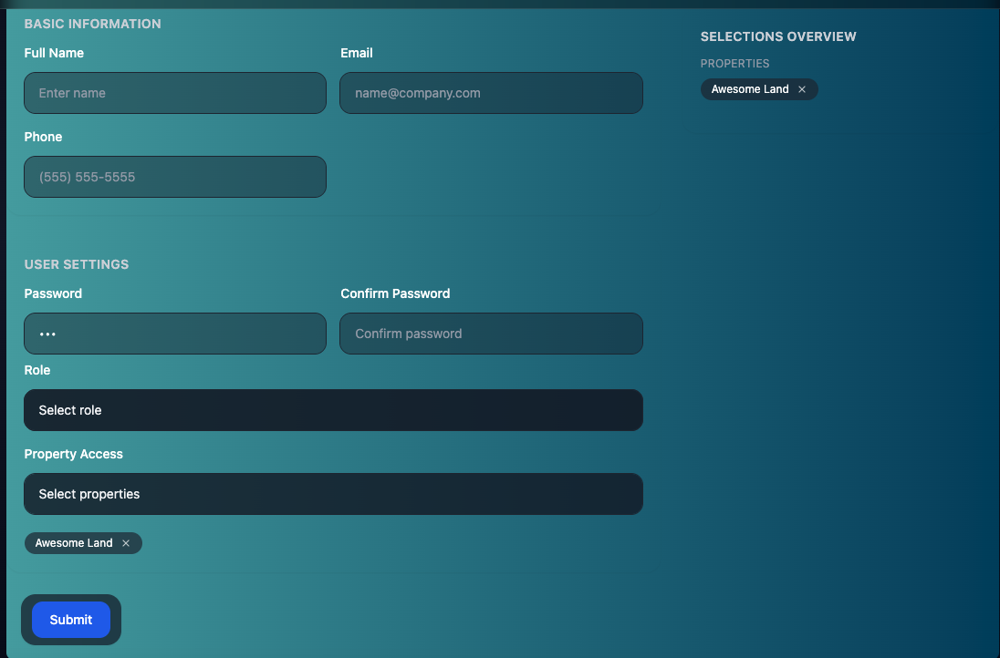
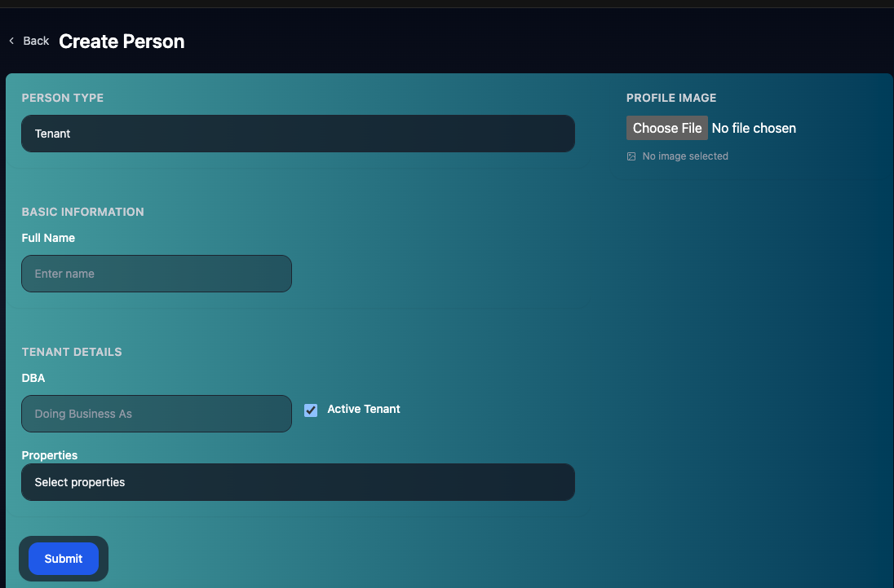
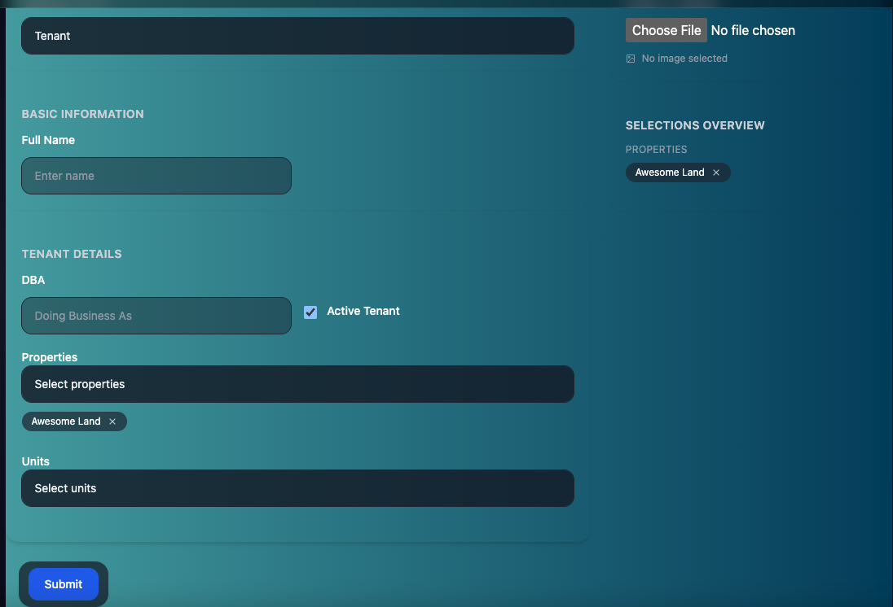
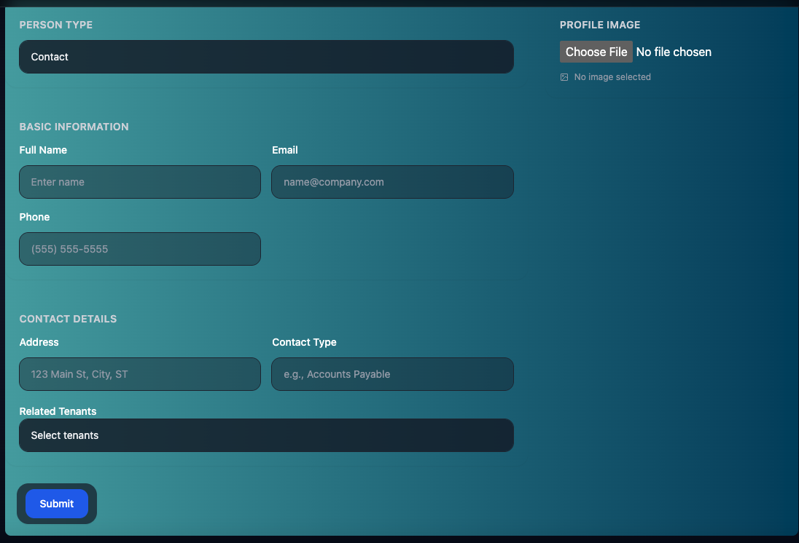
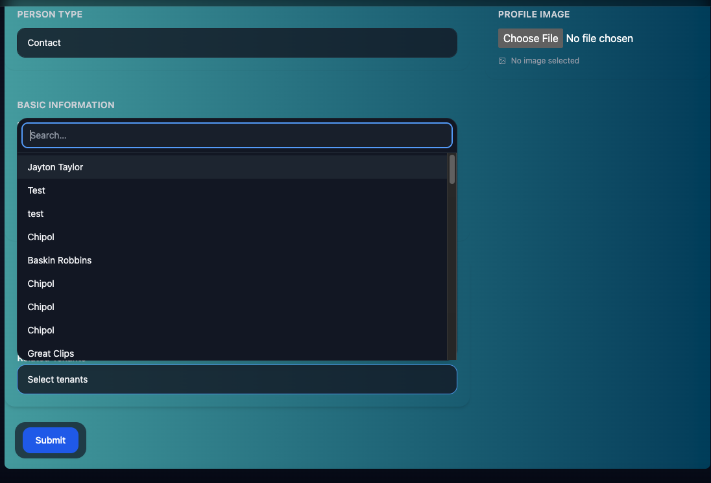
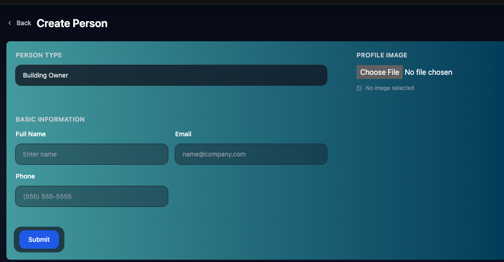

# Create Person

The Create Person Page allows you to create 4 different types of people. Depending on your permission level:
- App Users
- Tenants
- Contacts
- Building Owners

Each Type of Person Can Have an Image. Simply select Choose File under Profile Image on the Right Side of the screen.

## App Users
App Users are people who use Lease Link. If you're a Company Admin, or you have permission set to create App Users,  you can create App Users. (Learn more about permissions in [Roles](./Roles.md))

This is used when a new Property Manager comes on board or you would like another person in your company to have access to Lease Link.

To Create an App User you will need:
- Full Name
- Email
- Phone
- Password (Will be changed by User)
- Confirm Password 
- Role (Setup in [Settings](./settings.md))
- Property Access
    - What Properties does this User have access too.
    - Company Admin Roles will have access to all Properties automatically, and you will not have to choose.
    - Setup Properties in [Create Property/Unit](./facility.md)

Once you select a Property it will appear on the right side of the screen as a selected property, and it will be removed from the Property Access Dropdown. You can remove Properties by clicking the X on the selected Property.

## Tenant
Tenants are companies who occupy units in your properties. A Tenant can occupy more than one unit or property. Say Starbucks has multiple locations at your properties. Starbucks is 1 Tenant with multiple Leases and Units. You can ask questions in chat to each specific unit, and view the extracted leases for each unit starbucks operates seperately. A Tenant can have more than 1 lease per unit it occupies!

You can batch create tenants in [Settings](./settings.md).

Tenants will need:
- Full Name
- DBA (optional)
- Active (Checkbox) (Are they an active tenant or old tenant?)
- Properties
- Units

To add multiple units simply add them to multiple units and/or properties.

Before you can add them to units, you have to add them to a property (or properties)

Once you have added them to a Property, you may add them to a Unit

If there are no Tenants or Units, create them at [Create Property](./facility.md).

## Contact

Contacts are People who you contact about a Tenant.

Whether it's the manager, lawyer(s), accountants. Anybody who you contact about the Tenant Details will be a contact. 

Contact(s) are used in Email Integration (Currently in Development). When you're email in integrated with Lease Link, Lease Link will pull emails from the created Contacts and add them to the Tenant. Once Email Integration is finished, all you have to do is ask questions in chat, and it will use the emails with those contacts.

Contacts will need: 
- Full Name
- Email (Important for Email Integration)
- Phone
- Address
- Contact Type
- Related Tenants

You may search for tenants in the search bar when you click Related Tenants

When done Click Submit.

## Building Owner

Building Owners are simply for you to see quickly who building owners are for a Property. They are required to create a Property. They currently serve no other function in Lease Link.
A Building Owner does not currently integrate into Email. They must be a contact as well. A Building Owner requires:

- Full Name
- Email
- Phone

When done Click Submit.