# Roles

Roles are the permissions that users have inside of Lease Link. Lease Link has custom Roles, so you can change specific roles for specific types of people. Giving lots of flexibility.

If you wanna create/edit roles check out [Settings](./settings.md) for more details.

When you Create a new role, it will be available for users in [Create Person](./Person.md) page. You can edit users roles, by going to [Setting](./settings.md)

Lease Link automatically creates two roles for your company:
- Company Admin
- Property Manager

## Company Admin
Company Admin has access to all permissions inside of Lease Link.

They can do everything in the 10 types of roles mentioned shortly.

This role cannot be edited (It would cause lots of issues and potentially make the app unusable for your company).

## Property Managers

Here are the default settings for a Property Manager. They can be edited!

Property Managers can:
- Ask Questions
- Create Tenants, Contacts, Units, and Owners
- View Tenants that they have permission to view
- Upload Leases
- Edit Tenants (Who they have permission to view), Contacts, Units, and Owners
- View Old Questions

Property Mananers Cannot:
- Create/Edit Properties
- Create/Edit Users
- Create/Edit Roles
- Access Settings
- Edit the Company
- Archive Tenants, Contacts, Units, and Owners,
- View Tenants not given permission to view
- View Leases not given permission to view
- Delete Leases

This Role is editible from settings!

## Role Type

When Creating A Role, you will need to assign a Role Name

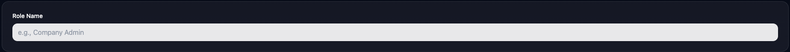

There are 10 types of Role Permissions that a User may have:

- User Permissions
    - Create Users
    - Edit Users
    - View Users
    - Delete (Archive) Users
    
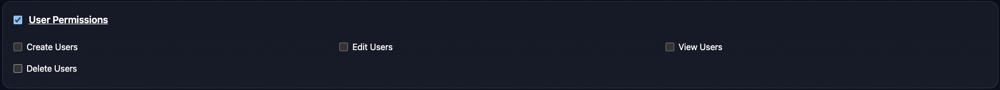

- Property Permissions
    - Create Properties
    - Edit Properties
    - Delete Properties
    - View All Properties
    
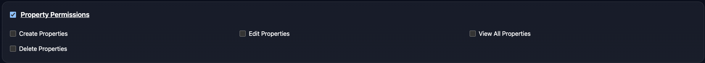

- Tenant Permissions
    - Create Tenants
    - Edit Tenants
    - View All Tenants
    - Delete Tenants
    
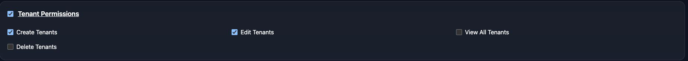

- Contact Permissions
    - Create Contacts
    - Edit Contacts
    - View All Contacts
    - Delete Contacts
    
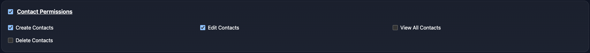

- Unit Permissions
    - Create Units
    - Edit Units
    - View All Units
    - Delete Units
    
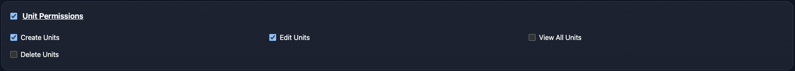

- Owner Permissions (Building Owners)
    - Create Owners
    - Edit Owners
    - View All Owners
    - Delete Owners

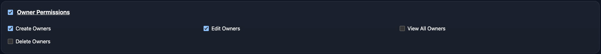

- Lease Permissions
    - Upload Leases
    - View All Leases
    - Delete Leases

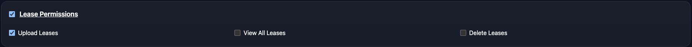

- Question Permissions
    - Ask Questions
    - View Old Questions

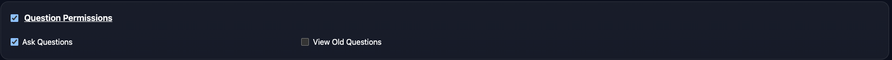

- Role Permissions (Edit this page)
    - Create/Edit Roles
    - View Roles

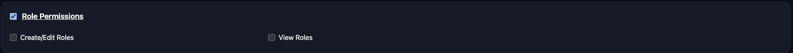

- Settings Permissions
    - Access Settings
    - Edit Company
    - Edit Subscription (Which Type of Bill you pay!)
    
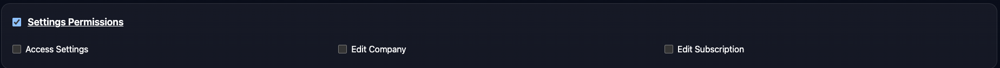