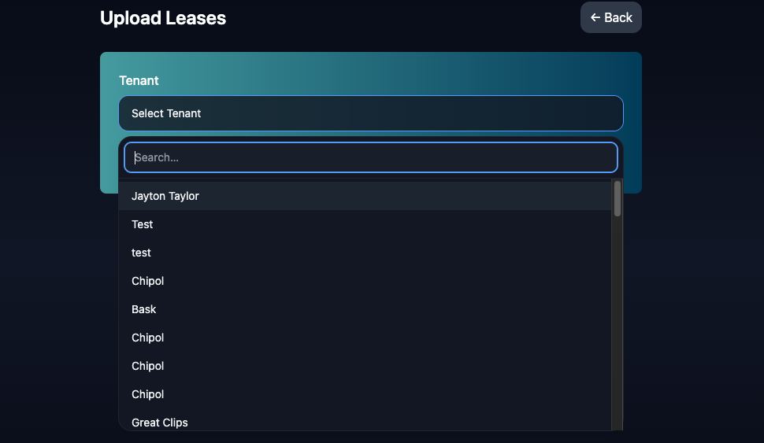
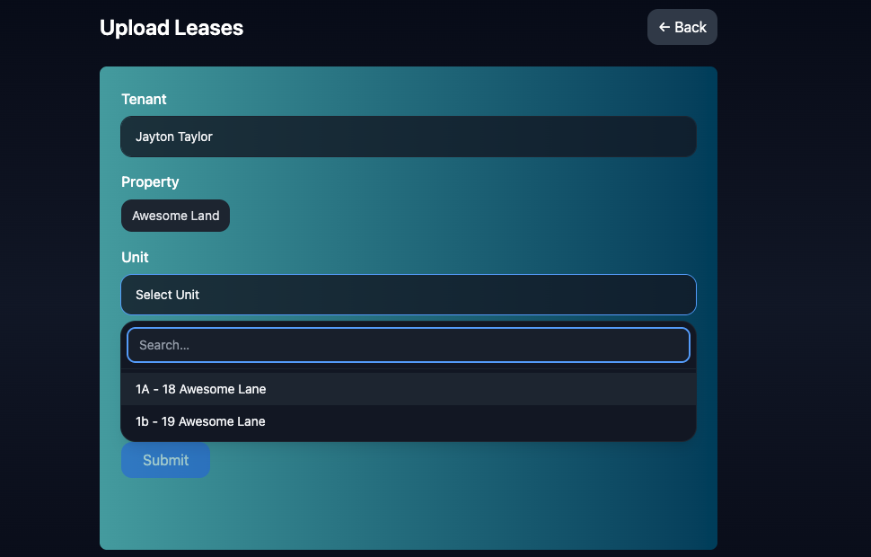
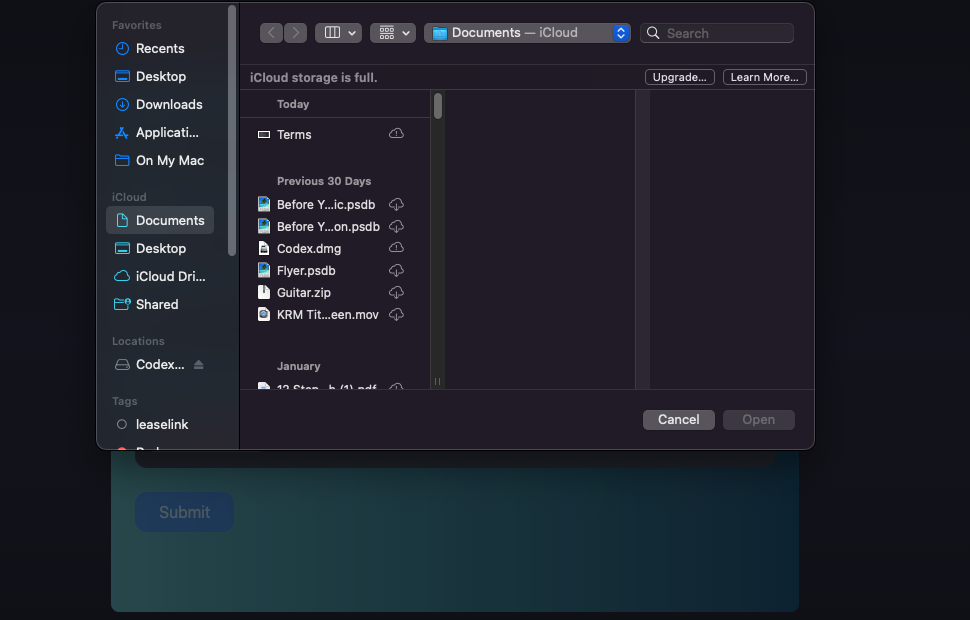

# Upload
The Upload Page is where you can upload all of your Lease Documents in order to extract, and ask questions about them. The process is simple.

## Step 1: Select a Tenant 
(Click Select Tenant to get Dropdown)

You may search for the Tenant you wish to upload the lease to!

## Step 2: Select the Property and Unit the Tenant is Connected to!
If the Tenant only has 1 Property and 1 Unit it will autoselect both.

This example, the tenant only has 1 Property, but two units, so we have to select the Unit!

## Step 3: Upload Leases
Once you've selected the Tenants, Click the choose files button to upload all the documents for that tenant at 1 time. 

You don't have to do each document seperately, you may upload all documents for that tenant at the same time.

If you're doing a tenant with multiple units, and each unit has a seperate lease, you will have to upload each units grouped documents seperately. EX: Starbucks has a two units. You can upload the lease, amendment(s), and renewals for 1 unit at the same time. Then the lease, amendment and renewals for the other unit in a 2nd upload group. 

Click Submit

**This process is currently quene based, so if there are several tenants uploading it may take several hours before this is available for chat and extraction. You will receive an Email when the uploads are complete.**