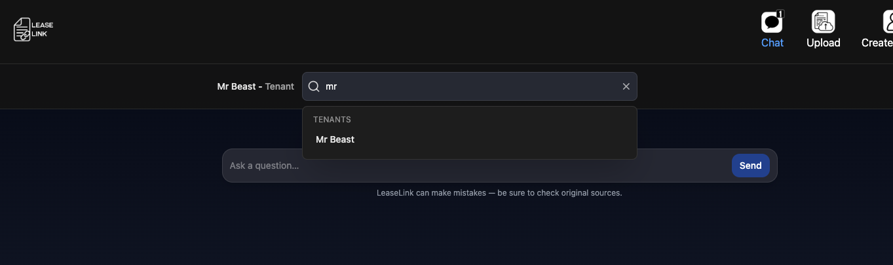
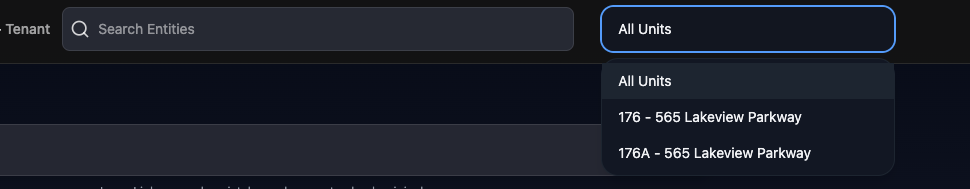
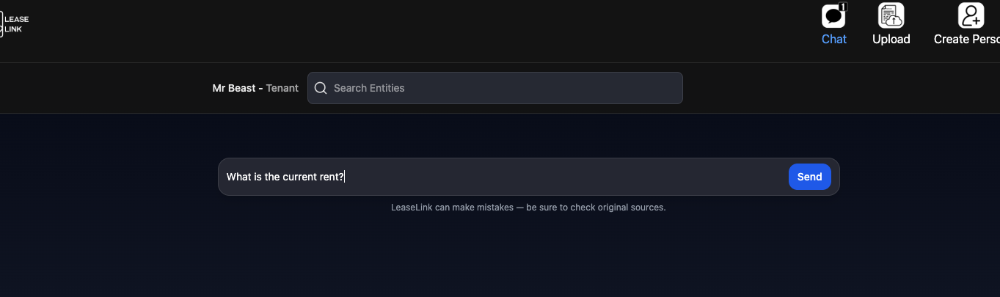
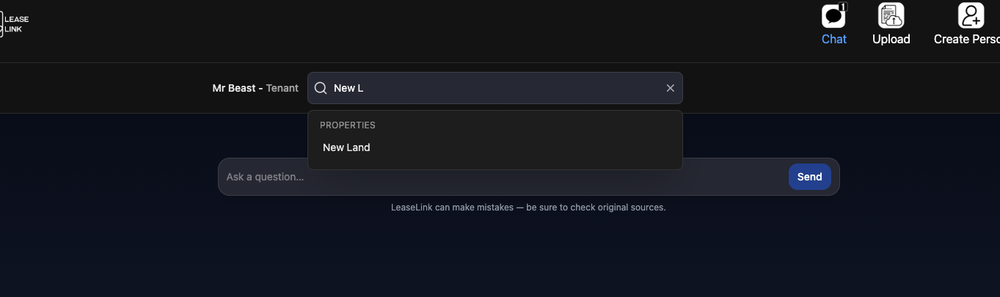
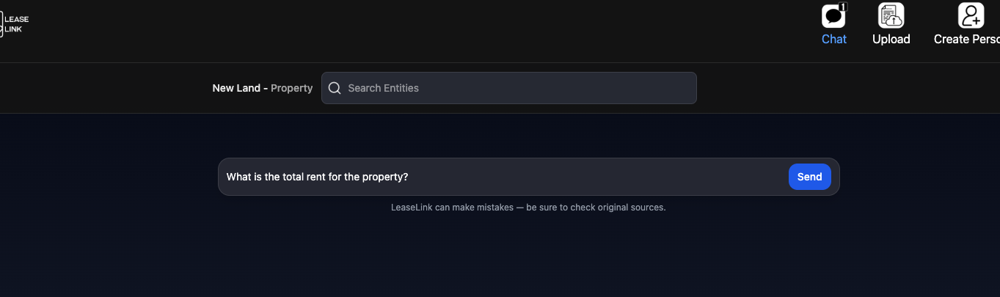
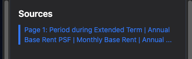
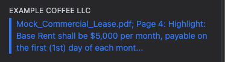
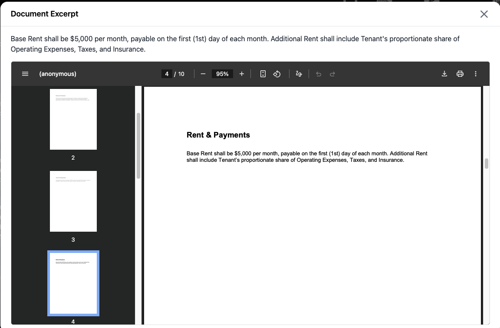
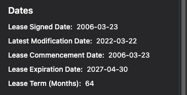
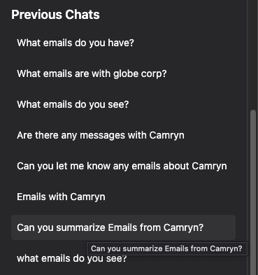

# Chat Page

The Chat Page allows users to talk to their leases. It is mainly powered by Claude AI, and you can ask any questions about your leases. It will search for what the lease says and a summary or explanation based on the context of the lease. Every Answer is backed by sources directly from the lease in order to provide maximum assurance that the answers that are given are correct. 

Before we get started, navigate to the Chat Page after logging into Lease Link. It will be on the top bar labeled "Chat"

There are 6 main features to the Chat Page:
 - Tenant Chat
 - Property Chat
 - Sources
 - Dates
 - Previous Messages
 - Email Integration

 ## Tenant Chat
 Tenant Chat allows you to message your tenants directly. Complex Questions will be answered with high accuracy to solve problems for your tenants!

 Simply Search for the tenant you would like to ask questions to in the search bar right underneath the navigational top bar.

 There will be a Tenant Label above all of the tenants.

 

 Tenants that have multiple Units (EX: Starbucks rents from two different Properties) will have an option to select which unit you wish to chat with. You can chat with each unit individually or all units if you wanna know something about every Starbucks lease that you currently manage.

 

 Once you have selected your tenant you may ask any question. It will answer the question using the uploaded leases [Upload Page](./Upload.md) and Emails if Email Integration is set up. 

 Lease Link will typicall respond in less than a minute.

 

 If you would like to view sources for an old tenant Message simply click on the AI response, and the sources will appear in the sidebar

 ## Property Chat
**Property Chat is not available on all Lease Link plans. Check your plan to see if Property Chat is included in your plan.**

The steps for using Property Chat are basically the same as the steps for using Tenant Chat, however the AI responds differently.

Start by searching for a property you would like to message. 

Then send your message.

Property Chat Messages take longer to load (typically around 1-5 minutes). There is often a large amount of data to process, so the AI will take longer to respond. 

It will send a response message for every tenant. This allows you to get specific answers for each tenant. Each Message will have sources!

The AI will also determine if the question requires a summary response for all tenants alongside each individual tenant response. If you would like a summary response ask questions like, how does (Question) effect the entire property? (Asking how it effects the entire property will prompt the AI to give a summary response).

To view the sources for each invidual Property Chat Message simply click on the message with the Tenant's data you want to view. It will load the sources for that message

## Sources
Sources are how you can know that the AI is responding with accurate answers. AI is a great tool that sometimes makes mistakes, but it will provide the page from the lease(s) in it's answer.

Sources will appear on the right-hand side of the screen with each source underlined and highlighted in blue.

If your using Property Chat, the sources will have the tenant's name above them.

When you Click on a Source it will open up a Pop-Up with all the information you need.

The Top Section shows the Text that the Ai took right from the document.

The Bottom Section shows a pdf viewer of the lease document it is from. The viewer will open to the page that the source came from.

**There may be multiple sources from the same document, with different page Numbers.** 

If the AI used two sections from the same page, it will not appear as a seperate source in the source list.

## Dates
**Terms and Rent is not available with all Lease Link Plans. Please Check your plan to see if Lease Extraction (Or Abstraction) is on your plan.**

In order to save you even more time, we have extracted key terms from the lease that are readily available to view in chat.

They are on the sidebar right underneath sources. The included terms are:
- Lease Signed Date
- Latest Modification Date
- Lease Commencement Date
- Lease Expiration Date
- Lease Term (Months)

Other Extraction terms available in TenantPage (Add Link to Tenant Page doc)

## Previous Messages
If you would like to go to a previous chat with the same Tenant or Property, you can go to the bottom right of the screen and find the previous chat. Simply click on the Chat you would like to view to open that Chat! Previous Chats will show for the tenant or property selected earlier.

## Email Integration
Email Integration is currently in development. Once it is finished, it will pull data from contacts that you [Created](./Person.md).

Email Integration can be setup in [Settings](./settings.md).

When it is set up, it will automatically check the email of your contacts for selected Tenant to see if Email has any relavent information for your question.

Email integration is not currently available in Property Chat.