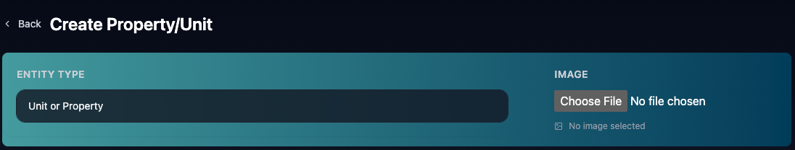
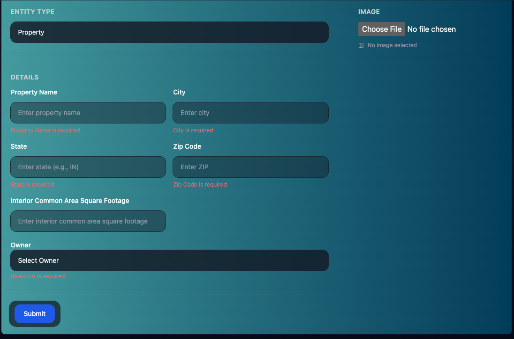
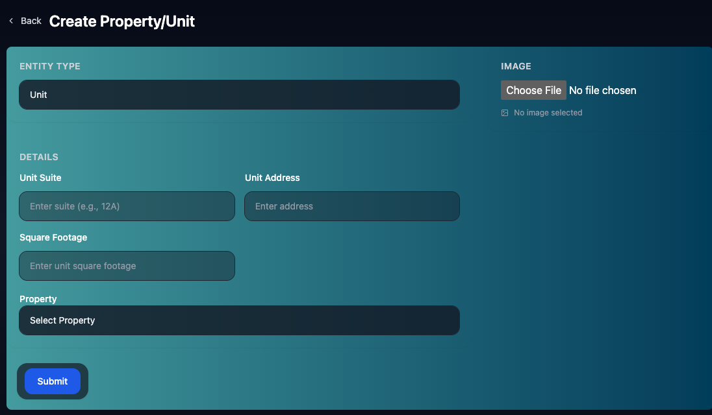
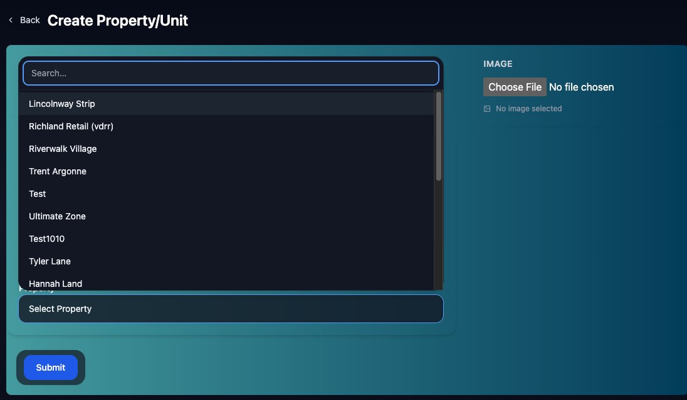

# Create Properties/Units
The Create Properties Page allows you create Properties and Units!

You may Create Units with a csv file in [Settings](./settings.md)

To Get Started Select Unit or Property to Create: 

You may also add an image to a property or unit.

## Create Properties
When Creating a Property you will need:

- Property Name
- City
- State
- Zip Code
- Interior Common Area Square Footage of the entire Property
- Managing Owner (see [Create Person](./Person.md))

Once you add these hit Submit.

## Create Unit(s)

Once you have at least 1 Property, you can create units individually!

When Creating a Unit you will need:
- Unit Suite
- Unit Street Street Address (State, City, and Zip are in Property, not unit)
- Unit Square Footage
- The Property it is in(Each Unit Can Only Belong to 1 Property)

You May Search for Properties in the Select Property Dropdown that appears when you click on it.

## Splitting Units

You can split units by editing a unit (see [Unit Page](./unit.md)). Then creating a new unit with the proper square footage. This will allow you to add other tenants and/or leases to the new unit!