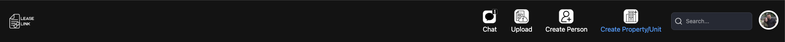
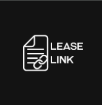
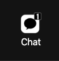
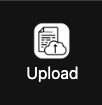
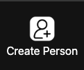
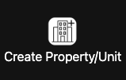
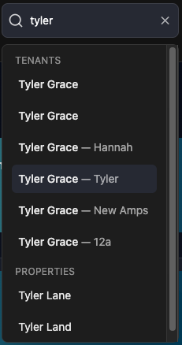
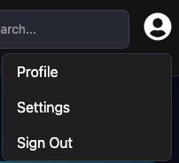

# General Navigation

Navigating Lease Link is fairly Simple. There are 5 buttons that will take you directly to pages on the Top Navigation Bar.

## Five Buttons

- Lease Link Logo !-> [Dashboard](./Dashboard.md)

- Chat Logo  -> [Chat Page](./chatPage.md)

- Upload Logo  -> [Upload Leases](./Upload.md)

- Create Person Logo -> [Create Person](./Person.md)

 
- Create Property/Unit Logo  -> [Create Property/Unit](./facility.md)

## Search Bar
The Search Bar will allow you to search for [Owners](./owner.md), [Properties](./property.md), [Tenants](./tenant.md), and [Units](./unit.md).

Simply Type in the Search Bar for the Entity you want, and it will find them. Once click it will take you to that entities page.

## Profile Image
On the Right hand side of the screen will be a Profile Image or a ? Logo. You can find a couple other settings pages here.

If you hover over the logo (Or Profile Image) it will show 3 more pages
- Profile
- Settings
- Sign Out

