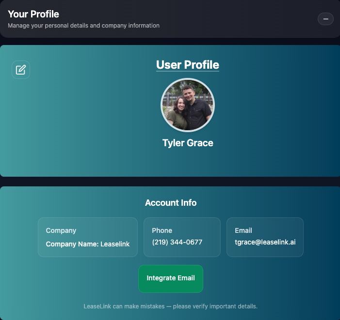

# Profile
The Profile page allows you to see the details that you have set for your specific profile.

You can edit your profile.

When you edit, you will be taken to the [Create Person](./Person.md) page to edit your profile. You can change your password, email, phone, image, Name, and role if you have permission to edit Roles!

You can also integrate your email from the Profile Page using the Integrate Email Button (Email Integration still in Development).