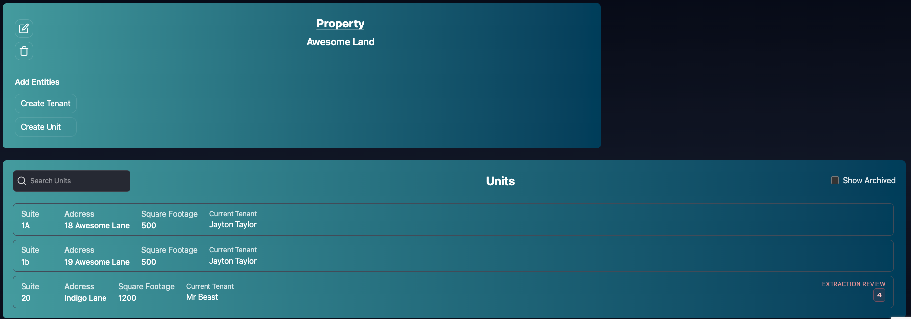
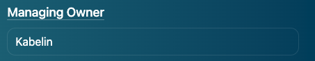
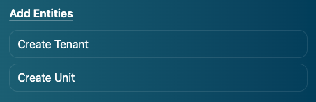
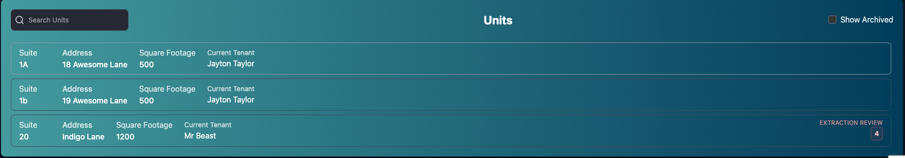
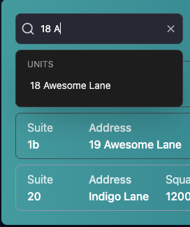
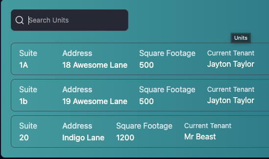
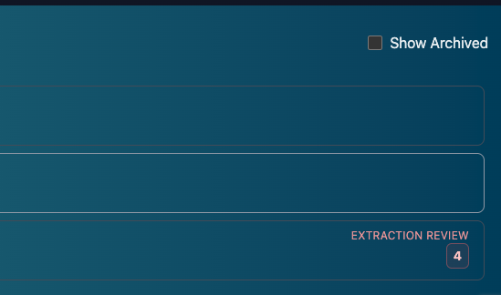

# Property Page
The Property Page shows the Property Details and the Units of each Property inside of it.

It allows you to select a Tenant who occupies a unit and/or a Unit

## Property Details
The Property Details allow you to edit the property.

They allow you to archive the Property:

You can view Building Owner Page (If available):

You can Create Tenants and/or Units from the Add Entities Buttons

## Unit List
The Unit List shows all Units in the Property.

You can search Units using the Search Bar. The Search is currently by Address

You see The Suite, Address, Square Footage, Current Tenant in the list. Clicking on the Unit will take you to the [Tenant Page](./tenant.md) of the Tenant that occupies that Unit. (This makes navigating to the Tenant Page easier!)

**If your Lease Link account has Extraction Available**
It will show any extraction terms that need approval from this list. See [Tenant Page](./tenant.md) for more details

