# Settings
**Users must have access Settings Permission in order to view Settings Page.**

 You can get to the settings page using the Profile in the Top Right of the screen then click on settings. Use [General Navigation](./generalNavigation.md) to learn more.

The Setting Pages has 6 Tabs:
- Company Settings
- Users
- Roles
- Subscription
- Import
- Integrate Emails (In Development)

## Company Settings

Currently Company Settings just shows the name of your company, and how many tenants you have.

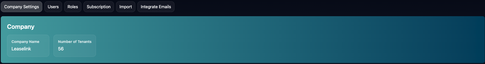

## Users
The Users tab shows all available Users for your account. You can use this edit Users, and archive Users. Click Archive to Archive Users. 

Editing Users will take you to the [Create Person](./Person.md) page where you can edit the Users Details!

You can see previously archived users by clicking archived! 

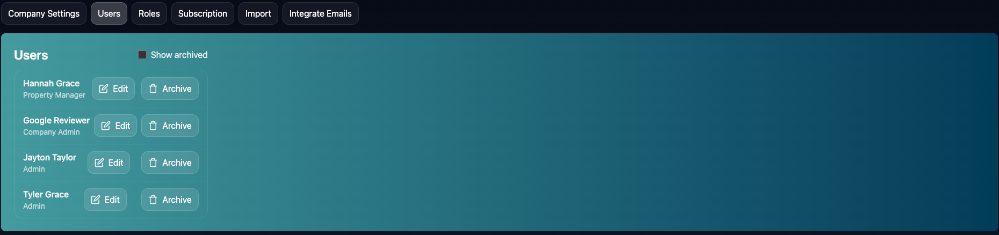

## Roles
Roles allows you to assign custom permissions for different types of Users. 

Settings shows you the current roles available as well as a link to create roles. You can edit Roles from the Edit button on each role. (Company Admin is not editable. It has all permissions available to user). Learn more about Creating and Editing Roles at [Roles](./Roles.md).

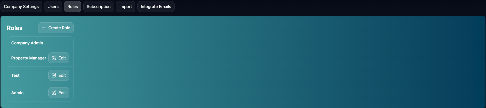

## Subscritpion
In the future, Subscription will allow you to edit your subscription.

We are currently in Free Testing Stage, so there are no subscriptions yet!

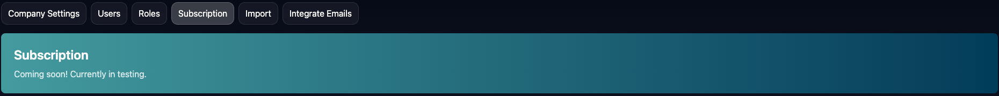

## Import
Import allows you to import batches of Units and Tenants into Lease Link without having to create them individually. Make sure to create properties inside Lease Link before importing.

Select whether you want to import Units or Tenants.

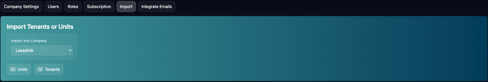

### Units
Download the Units CSV Template using the Download Units Template Button

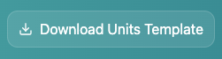

Open the CSV File and file out the rows with all of your units

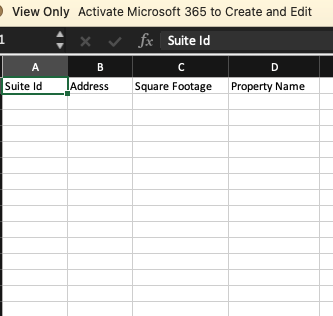

Make sure the Property Name matches Properties that are created inside of Lease Link or it won't work.

Once you edit the file, save it on your computer. Then click choose file in Lease Link. 

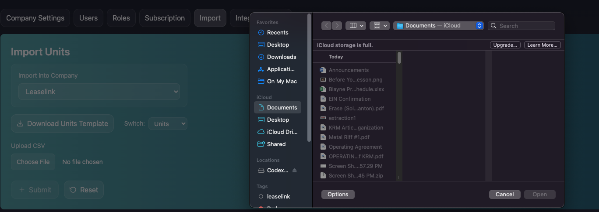

Click Submit.

### Tenants
Download the Tenants CSV File using the Download Tenants Template Button.

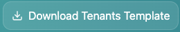

Once you downloaded it, enter the Unit Suite and Address exactly as you did on the Units you are creating.

You can currently add a tenant to multiple units, but if they need to be at multiple properties, you will need to add them inside of Lease Link.

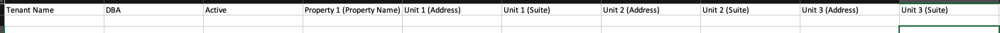

Once you edit the file, save it on your computer. Then click choose file in Lease Link.

Click Submit.

## Email Integration

Email Integration currently in testing.

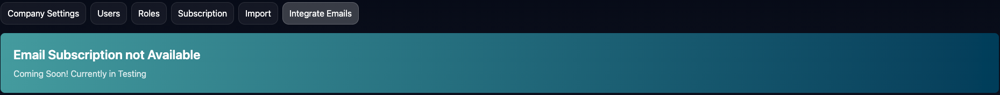