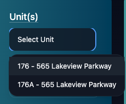
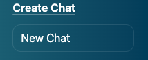
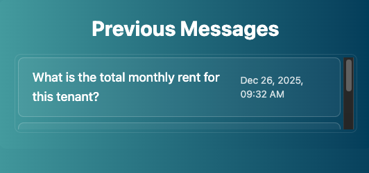
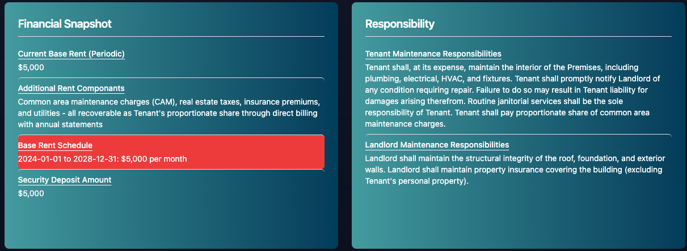
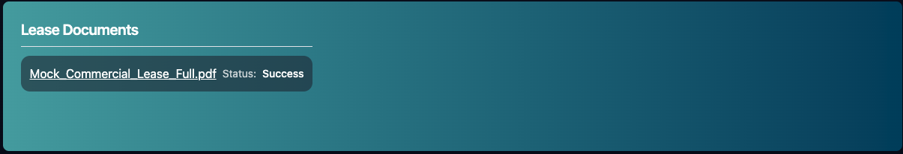

# Tenant Page

Welcome to the Tenant Page. You Can see All the Tenant Details Here. There are 5 Main Sections about using the Tenant Page that we will cover:
- Profile
- Previous Messages
- Extraction
- Contacts
- Lease Documents

## Profile

The Profile Allows you to:

Edit the Tenant

Archive the Tenant

View the Unit the Tenant is in. If the Tenant Has Multiple Units you will have to Select 1!

View a New Chat for the Tenant

## Previous Messages

You can view Previous Messages Sent From the Tenant on the Previous Messages Panel. Clicking on a Message will take you to the [Chat Page](./chatPage.md) while loading that message.

## Extraction
The Tenants will have terms that are extracted from the lease documents provided! View [Extraction](./Extraction.md) for more details!

## Contacts
Contacts are people who you contact for information about the tenant or unit they are leasing. You can add building contacts, accountants, lawyers, the tenant Manger, and whoever else needs to for this list.

The reason contacts are important is Email Integration. (Currently in Development) When Chatting with the Tenant, you can easily integrate your email so that when you ask a tenant Question, it will search your Email for Emails with the contacts of the tenant. So if there is additional context about question you are asking in email it is provided!

So add contacts of anybody's email can provide context to the questions!

## Lease Documents
At the Bottom of the Tenant Page, you can see all of the lease documents that are uploaded for that tenant. If you are unsure wether a document is missing from a tenant, you can check the bottom of the Tenant Page.

Also sometimes there are errors when uploading documents. The bottom of the page will let you know if there was an error with the document, and it will allow you to reload that document right away

You can also click on the documents to view the leases right from lease link. So if you need a quick place to read a document, Lease Link has it

