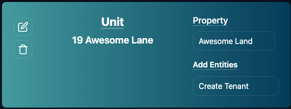
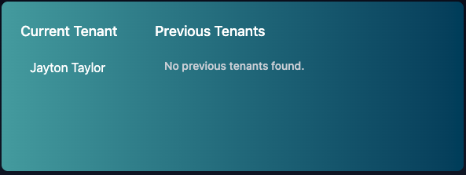

# Unit Page

The Unit Page in Lease Link is very simple.

- You can view the details of the unit.
- Look at Current/Previous Tenants

## Unit Details

In the details of the Unit You can see the Unit Address.

You can edit the unit.

You can archive the unit.

## Tenants

In the right hand side of the Unit Page, you can See the Current Tenant and any past tenants the Unit May have had in Lease Link!

